# FreshandFine

https://laylaadhar879-ops.github.io/FreshandFine/

**Table Of Contents**

- Home page
  * nav menu
  * Hero Section 
  * welcome h1
  * About us
  * content
  * footer
- Products page
  * nav menu
  * Sections with headings
  * content and images
  * footer
- Sign up form
  * nav menu
  * sign up form 
  * subbmit button
  * footer
- Thank you page
  * nav menu
  * thank you message 
  * return to home button
  * footer

I have created a website for a family owened farm who want to advertise the fresh produce that is sourced from their farm. They want to showcase the bottled fruit juice that they have spent years working on trying to perfect it and make it suitable for everyone without adding any harmful ingredients.  

**Brief**

When the pageis loaded you are welcomed by the hero section, which containes a video of an orange tree with a heading of "welcome to fresh and fine". The button under the heading will lead you straight to the products page. As you scroll down there is an overall background information about the farm and as you scroll further you can select the category of your choice whcih will display more information. In the nav section 'home and about us' will lead you to this.The products page contains cards of different products and their prices. In the menu When you click the contact us it will lead you to the footer where you can see the different contact options and social media links. The sign up page allows viewers to sign up to recieve newsletter from the farm whcih could include any new products they sell, or just any general information that is updated or changed. When submitted they will be redirected to a thank you page to show completion .

I created the html files on vs code, created an assets folder and sub folders for videos, images and css. I then created my css file. I went to setting and created a repository called fresh and fine, i added the index.html file and started working on my code. I used Ai to help me with the grid layout and the ai auto complete that comes with vs code (emmet). After i was done with one section I commit it with git and Push the code. Half way through my project I decided to deploy the webpage, so i went to pages, selected the main branch, made it a public repository, added a readme file and deployed it. That way I could still work on it and see how it would look. 

**User Story 1**

As a customer, I want to browse fresh and organic products so that I can see what’s available before making a purchase.

**Acceptance Criteria**

- Each product shows name, image, description, and price.

- The layout adapts to desktop, tablet, and mobile screens.

- Products are displayed and visible in appropriate category.

**User Story 2**

As a visitor, I want to sign up for the farm’s newsletter so that I can receive updates about new products and promotions.

**Acceptance Criteria**

- Sign-up form includes fields for name and email.

- Form validates email format before submission.

- Confirmation message appears after successful sign-up.

- Newsletter sign-up form is visible on both desktop and mobile.

**User Story 3**

As a visitor, I want a responsive navigation menu so that I can easily access different sections of the website on any device.

**Acceptance Criteria**

- Desktop view shows a horizontal navigation bar.

- Mobile view collapses into a menu icon.

- Navigation links include Home, Products, About Us, Contact, Sign Up.

- Menu works consistently across browsers.

**User Story 4**

As a visitor, I want to read about the family farm so that I can trust the source of the products.

**Acceptance Criteria**

- “About Us” page includes farm history, mission, and values.

- Page includes images of the farm and family.

- Layout adapts to different screen sizes.

- Content is easy to read.

**User Story**

As a visitor, I want to contact the farm directly so that I can ask questions about products or delivery.

**Acceptance Criteria**

- Contact Information is Easily Accessible.

- Information must include Email, Phone number and social media.

- Contact Infromation is responsive and easy to use on mobile.

**Bootstrap**

Using bootstrap I have added a responsive nav section to all my pages and cards to my home page to showcase 'About us' information. In my second page I have used cards to create a product layout with its prices.

**Google Fonts**

For my primary font I have chosen to use Open Sans. 

- Uasgae: additional information, main body text and navigation links.

- Reasons: Easy to read, fits my layout and theme, has a professional look

For my seconday font I used DM Serif Display.

- Usage: For my headers and Branding.

- Reasons: Easy to read while adding depth and dimention, not too plain and i'm able to use it for my headers. Again fits the professional theme.

**Images and Videos**

I have chosen my video that I used for my hero section from canva. In the products page i personally created the images of the drinks through canva. 

**image source**

sign up form background: 
https://images.pexels.com/photos/6216870/pexels-photo-6216870.jpeg?auto=compress&cs=tinysrgb&dpr=3&h=750&w=1260

About us section: 
https://ogden_images.s3.amazonaws.com/www.farmcollector.com/images/2023/03/07144802/horse-drawn-lister-plow.jpg
https://tse3.mm.bing.net/th/id/OIP.BsCaBGYaRPPApOxKBjkj7wHaE8?rs=1&pid=ImgDetMain&o=7&rm=3
https://tse3.mm.bing.net/th/id/OIP.zQ6pja4oHvrtoTNz2bUNCgHaEK?rs=1&pid=ImgDetMain&o=7&rm=3
https://tse2.mm.bing.net/th/id/OIP.p3sCzgy3Rc86sA_pKgjcsAHaEL?rs=1&pid=ImgDetMain&o=7&rm=3
https://tse2.mm.bing.net/th/id/OIP.4ILewu_4rqU_fht4LausMgHaE8?rs=1&pid=ImgDetMain&o=7&rm=3

Products page:
https://www.wcolemanandson.co.uk/images/products/organic-whole-milk-main.jpg
https://tse1.mm.bing.net/th/id/OIP.q1-lB5RvkvEZHIjBklG8RwHaFW?pid=ImgDet&w=474&h=342&rs=1&o=7&rm=3
https://thumbs.dreamstime.com/b/natural-organic-honey-glass-jar-dipper-honeycombs-near-food-background-369327385.jpg"
https://everest-icecream.com.au/wp-content/uploads/2024/05/picture1-wfhjungsrsyh.jpg

**Color Scheme**

This is the color pallete that I have Chosen for the Webpage

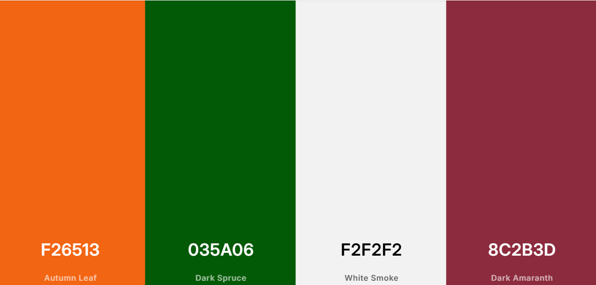

I chose these colors because they're bright and it captures the attention of the audiance. When they're layed out and used correctly they compliment eachother.

I have used Canva to generate my mockup device response. The image shows the site on different devices, size screens and how my webpage adapts to the screens. I also used canva for my wireframe to layout the text and images in order to plan out the acceccibility of contents. For my icon, I seleceted an image with a transparent background from google images and used Favicon to generate the links in order for me to use it as an icon.

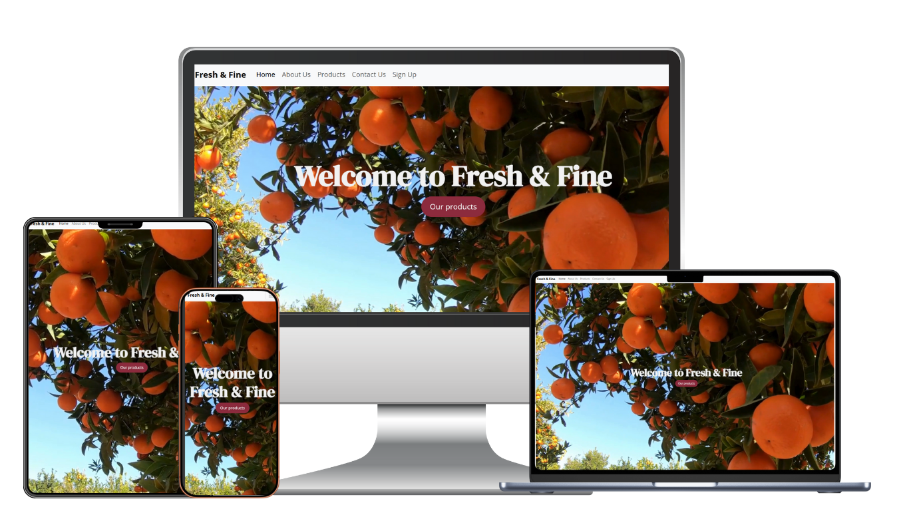

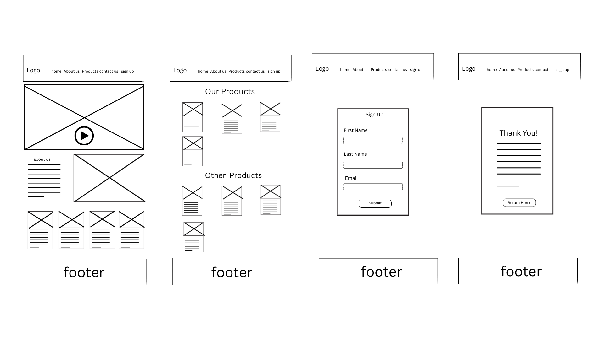

**Desktop and mobile display**

Home page on desktop and mobile

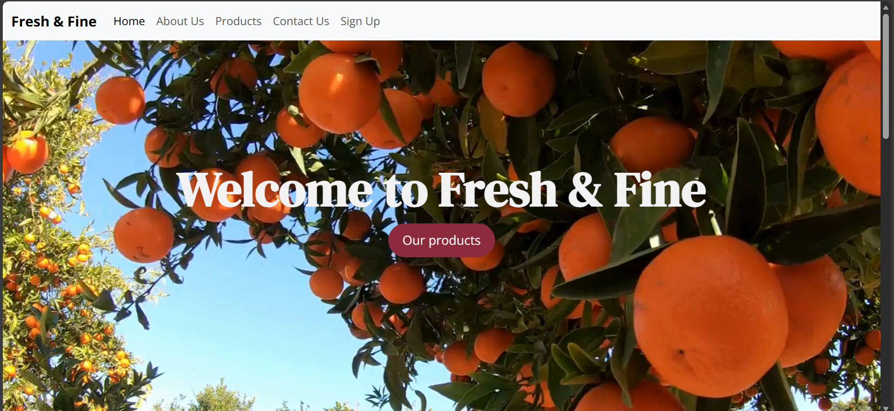
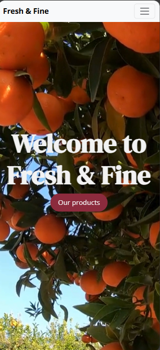

About us on desktop and mobile

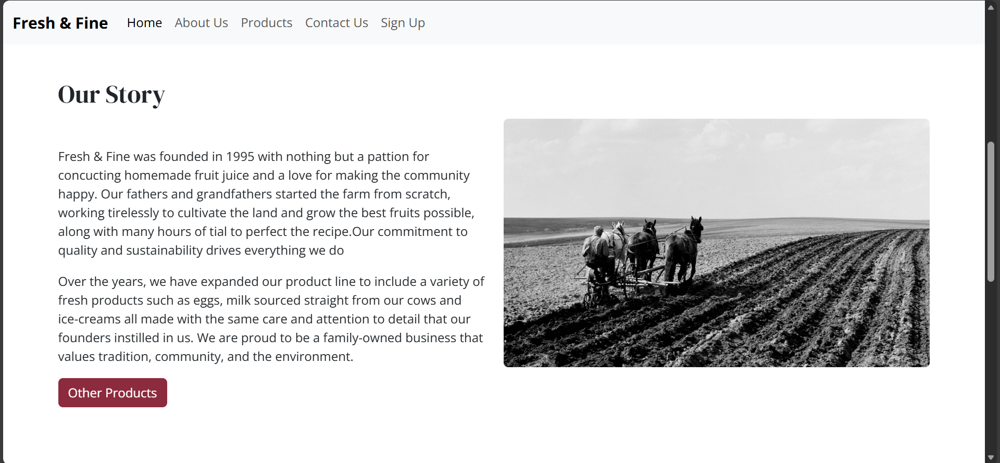
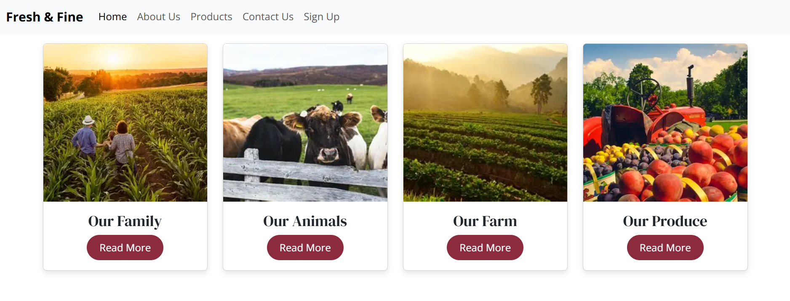
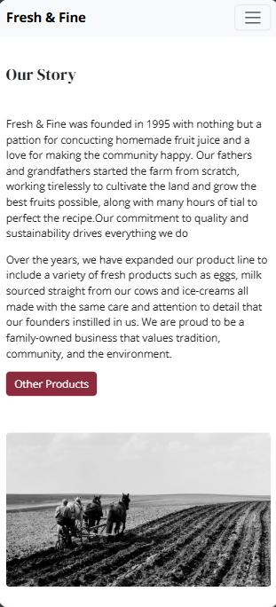
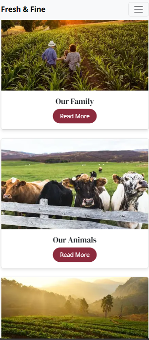

products on desktop and mobile

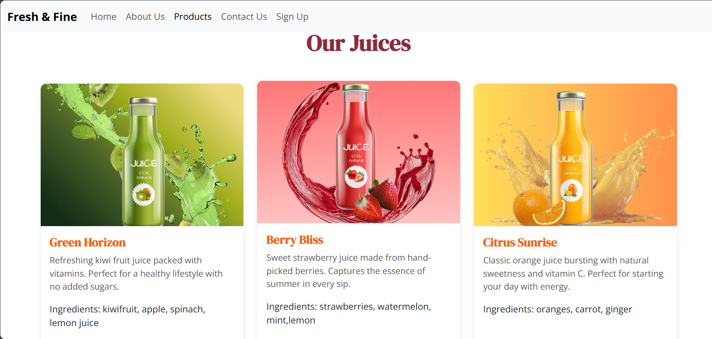
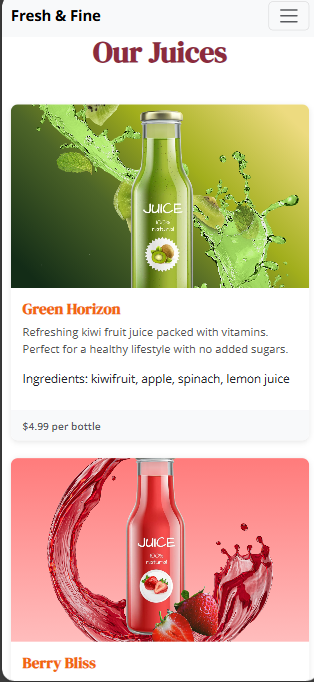

contact us on desktop and mobile

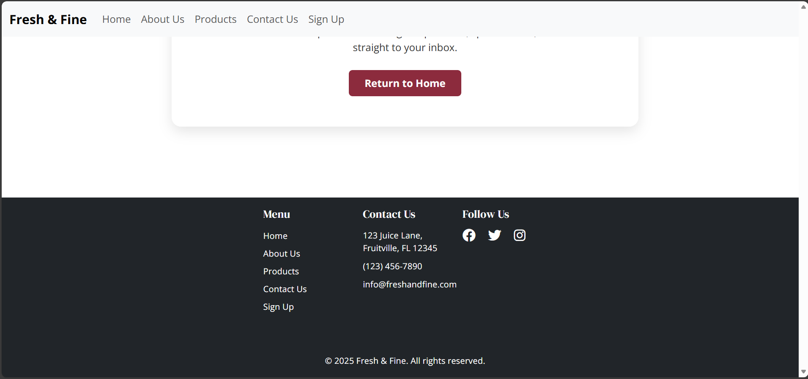
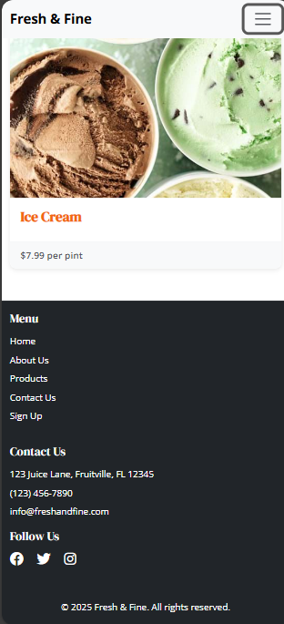

sign up on desktop and mobile

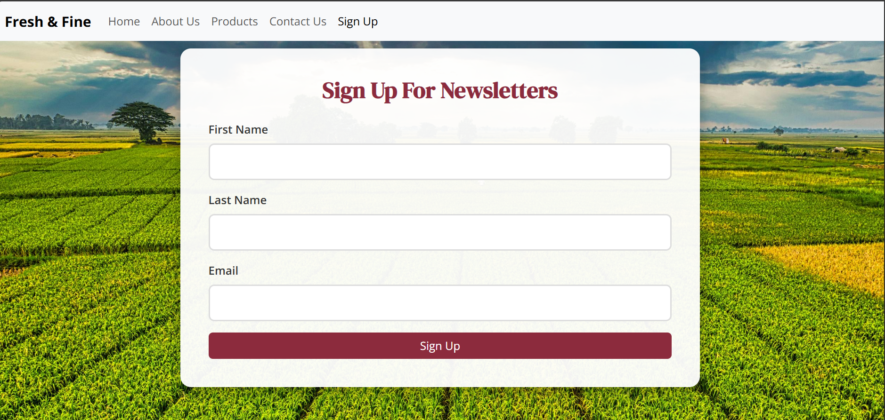
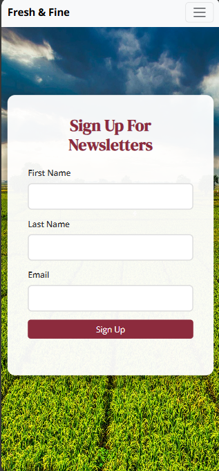

thank you on desktop and mobile

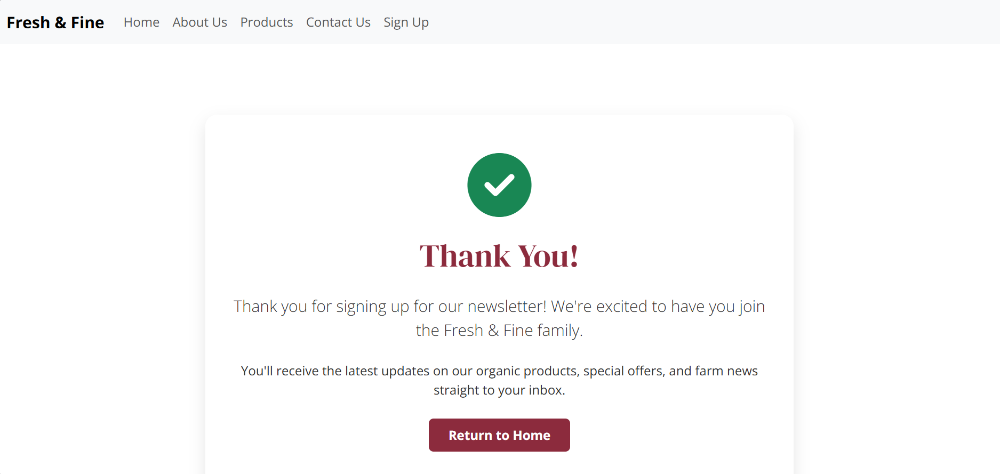
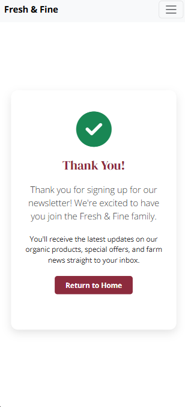

